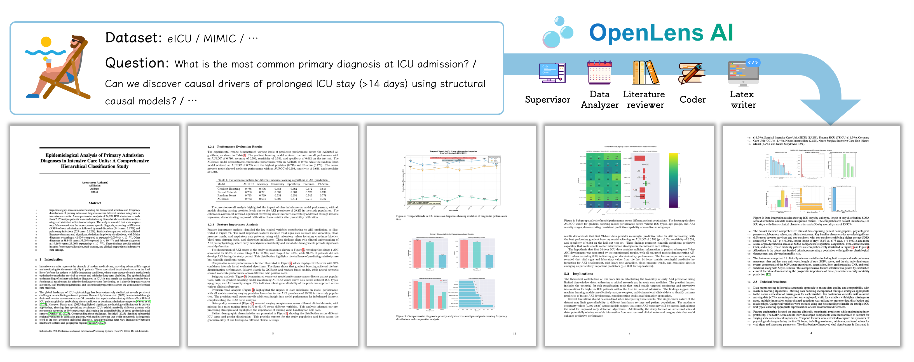

**[English Version](README.md)**

# OpenLens AI：全自主多模态科研智能体

<p align="center">
  
  
  
</p>


<div align="center">
<p>
<strong>📄 论文：</strong> <a href="https://arxiv.org/abs/2509.14778">在 arXiv 上阅读我们的研究论文</a> 

<strong>🌐 项目主页：</strong> <a href="https://openlens.icu">浏览详细文档和示例</a> 

<strong>🚀 立即体验：</strong> <a href="https://app.openlens.icu">直接在浏览器中使用我们的云应用</a>
<p> </p>

</p>
</div>

<table>
  <tr>
    <td style="width:3cm; text-align:center;">
      
    </td>
    <td style="text-align: justify;">
      <strong>OpenLens AI</strong> 是一个专为医学/ML/统计研究或任何数据驱动项目设计的完全自主的多模态智能体，为 AI+医学研究优化。
      只需提供您的数据集和一个单行的研究想法，它便能独立进行文献综述、设计实验、分析数据并生成全面的研究报告——<strong>无需任何人工干预</strong>。
    </td>
  </tr>
</table>

🔥 **新功能：** 支持通用领域（例如软件、机器学习等）。

🔥 **新功能：** 支持中文图表和论文写作。

## 🔍 核心特性

<p>
无需安装！访问我们的 <a href="https://openlens.icu">项目主页</a> 了解更多关于 OpenLens AI 的信息，或尝试我们的 <a href="https://openlens.icu">云应用</a>，无需任何设置即可体验全自动研究智能体。
</p>



- ✅ **自动化文献综述**：根据您的研究问题搜索和总结论文
- ✅ **数据分析**：分析数据集并生成综合报告
- ✅ **实验设计**：建议并验证实验方法
- ✅ **代码生成与执行**：使用 [OpenHands](https://github.com/All-Hands-AI/OpenHands) 生成和执行用于数据分析与实验的代码
- ✅ **LaTeX 论文生成**：自动创建和管理 LaTeX 格式的研究论文和报告
- ✅ **交互式用户界面**：基于 Streamlit 的界面，用于监控和交互研究过程
- ✅ **上下文管理**：通过向量搜索自动管理智能体的上下文信息
- ✅ **智能体文件管理**：使用 [👕 file1.agent](https://github.com/jarrycyx/file1agent) 识别和删除重复文件和模拟数据
- ✅ **视觉-语言反馈**：集成 VLM（视觉语言模型）进行可视化和反馈
- ✅ **中文写作支持**：全面支持中文论文写作
- ⬜ **基于 Powerpoint 的图表**：自动生成基于 Powerpoint 的演示图表以获得更好的视觉质量（以替代当前的 graphviz 图表）
- ⬜ **通过长上下文模型管理上下文**：集成长上下文模型进行上下文管理（作为当前基于向量搜索方法的补充）

## Star History

[](https://www.star-history.com/#jarrycyx/openlens-ai&type=date&legend=top-left)

## 🚀 快速开始

### 前置条件

- Python 3.9 或更高版本
- Docker（用于 OpenHands 运行时环境）
- 以下服务的 API 密钥：
  - LLM 服务（例如，DeepSeek, OpenAI, Qwen 等）
  - Tavily 搜索 API（用于文献搜索）

### 安装

0. 克隆代码库：
```bash
git clone git@github.com:jarrycyx/openlens-ai.git --recurse-submodules
cd openlens-ai
```

1. 确保已安装 Docker：

直接拉取运行时镜像（**推荐**）：
```bash
docker --version

# 拉取 Docker 镜像
ALIYUN_REMOTE_DOCKER_NAME=crpi-hbt8nkulkjqjqkie.cn-hangzhou.personal.cr.aliyuncs.com/cyx-docker/openlens-ai:runtime-latest
docker pull $ALIYUN_REMOTE_DOCKER_NAME
docker tag $ALIYUN_REMOTE_DOCKER_NAME openlens-ai:runtime-latest
```
或者从源码构建（如果需要支持中文论文写作，请下载 [windows-fonts.tar.gz](https://github.com/jarrycyx/openlens-ai/releases/download/v0.1.0/windows-fonts.tar.gz) 或收集 ```C://windows/Fonts/``` 中的字体）：
```bash
# 可选：收集中文字体
cd openlens_ai/tools/openhands_configs/ && tar -xzvf windows-fonts.tar.gz

# 构建 tex-live 等基础 docker
bash openlens_ai/tools/openhands_configs/build_docker_base.sh 
# 构建满足 OpenHands 要求的运行时 docker
bash openlens_ai/tools/openhands_configs/build_docker_runtime.sh 
# 检查构建镜像的 ID
docker images
# 将镜像名称标记为 openlens-ai:runtime-latest
docker tag <IMAGE_ID> openlens-ai:runtime-latest
```

2. 安装依赖：

首先安装 [file1.agent](https://github.com/jarrycyx/file1agent):
```bash
cd modules/file1agent
pip install -e .
cd ../../
```
然后 ```cd modules/OpenHands``` 并按照 [instructions](https://github.com/All-Hands-AI/OpenHands/blob/main/Development.md) 安装 OpenHands。

然后使用 mamba 安装 OpenHands：
```bash
# 下载并安装 Mamba（conda 的更快版本）
curl -L -O "https://github.com/conda-forge/miniforge/releases/latest/download/Miniforge3-$(uname)-$(uname -m).sh"
bash Miniforge3-$(uname)-$(uname -m).sh

# 安装 Python 3.12、nodejs 和 poetry
mamba install python=3.12
mamba install conda-forge::nodejs
mamba install conda-forge::poetry
```

或者使用 conda：
```bash
cd modules/OpenHands
conda create -n py312 python=3.12 # 或者使用 uv / venv
conda activate py312
conda install conda-forge::nodejs
conda install conda-forge::poetry
make install
```

安装 Python 依赖：
```bash
# 如果希望可视化工作流，请安装 graphviz：
#   sudo apt-get install graphviz graphviz-dev
#   pip install pygraphviz

conda create -n py312 python=3.12 # 或者使用 uv / venv
conda activate py312
pip install --upgrade pip
pip install -e .
```

3. 配置环境变量：
```bash
cp .env.example .env
# 使用您的 API 密钥和模型设置编辑 .env 文件
```

### 配置

在您的 `config.toml` 文件中，配置以下内容：

```yaml
[llm]
language = "chs"  # 语言设置："chs" 表示中文，"eng" 表示英文

[llm.chat] # 用于通用任务和编码的主要语言模型
model = "glm-4.5-air"  # 用于通用任务的主要语言模型
base_url = "https://cloud.infini-ai.com/maas/v1/"  # 模型 API 服务的基础 URL
api_key = "<您的 API 密钥>"  # 用于访问语言模型的 API 密钥

[llm.vision]
model = "glm-4.1v-9b-thinking"  # 用于图像分析任务的视觉模型
base_url = "https://open.bigmodel.cn/api/paas/v4/"  # 视觉模型 API 服务的基础 URL
api_key = "<您的 API 密钥>"  # 用于访问视觉模型的 API 密钥

[rerank]
rerank_model = "bge-reranker-v2-m3"  # 用于提高搜索结果相关性的重排序模型
rerank_api_key = "<您的 API 密钥>" # 用于访问重排序模型的 API 密钥 (infiniai 服务)
rerank_base_url = "https://cloud.infini-ai.com/maas/v1/"  # 重排序模型 API 服务的基础 URL

[tools]
tavily_api_key = "<您的 API 密钥>"  # 用于 Tavily 搜索服务（网络搜索）的 API 密钥

[docker]
docker_name = "openlens-ai:runtime-latest"  # 用于智能体环境的 Docker 容器名称

```

更多详细的配置选项，请参见 [config.full-example.toml](config.full-example.toml)。

### 运行应用

#### 选项 1：命令行界面

示例：
```bash
python -m openlens_ai.main \
  --question "重症监护环境中，心脏骤停事件前生命体征恶化的时间模式是什么？" \
  --dataset-path "datasets/eicu-demo" \
  --thread-id "pred_aki_trend_eicu_demo" \
  --notify-email "dzdzzd@126.com" \
  --interrupt-after-subgraph "none" \
  --language "chs" \
  --domain "medical" # 领域设置："medical" 表示医疗，"general" 表示其他领域
```

#### 选项 2：交互式 Web 界面

如果需要 HTTPS 支持，在 `.streamlit/config.toml` 中配置您的 HTTPS 设置。如果不需要 HTTPS 支持请将 `sslKeyFile` 和 `sslCertFile` 注释掉。

```bash
streamlit run start_app.py
```

然后在浏览器中打开 `http://localhost:8501` 以访问交互式界面。

## 🧠 系统架构

OpenLens AI 使用由 LangGraph 驱动的多智能体架构：

1. **文献综述员 (Literature Reviewer)**：搜索和分析相关文献
2. **数据分析员 (Data Analyzer)**：处理和分析数据集
3. **监督员 (Supervisor)**：协调研究过程并做出高层决策
4. **程序员 (Coder)**：生成数据处理代码和技术解决方案
5. **LaTeX 撰写员 (LaTeX Writer)**：生成研究论文和报告的 LaTeX 文档

智能体通过共享状态进行通信，并可以调用各种工具，包括：
- 网络搜索 (Tavily)
- 代码执行 (OpenHands)
- 文件操作
- 用于上下文管理的向量搜索
- **文献搜索工具**：
  - ✅ arXiv 搜索与论文阅读
  - ✅ medRxiv 搜索与论文阅读
  - ✅ Google Scholar 搜索
  - ✅ Tavily 搜索
  - ⬜ IACR ePrint 搜索
  - ⬜ Semantic Scholar 搜索与论文阅读
  - ⬜ PubMed 搜索

## 📁 项目结构

```
openlens_ai/
├── agents/              # 智能体实现
│   ├── coder.py
│   ├── data_analyzer.py
│   ├── latex_writer.py   # LaTeX 文档生成智能体
│   ├── literature_reviewer.py
│   └── supervisor.py
├── prompts/             # LLM 提示词模板
├── tools/               # 自定义工具和实用程序
├── utils/               # 辅助函数
├── build_graph.py       # 主图构建
├── chatbot.py           # 聊天机器人接口
├── frontend.py          # Streamlit 前端
└── state.py             # 状态管理
```

## 🧩 可选功能：GitHub 集成（自动推送实验产物）

OpenLens AI 提供一个 **可选功能**：将生成的代码产物自动发布到 GitHub。
如果你不配置这一部分，默认不会向 GitHub 推送任何内容。

### 1. 在 `config.toml` 中配置 GitHub

添加或修改 `[git]` 配置块：

```toml
[git]
# 可选：固定推送到某一个指定仓库
# repo_url = "git@github.com:<你的用户名>/<你的仓库名>.git"
repo_url    = ""

branch      = "main"                 # 提交和推送所使用的分支
token       = "<YOUR GITHUB TOKEN>"  # GitHub 个人访问令牌（PAT）
repo_prefix = "openlens-"            # 自动创建仓库时使用的前缀
private     = true                   # 自动创建的仓库是否设为私有
```

- 当 `repo_url` **已设置** 时 → 实验产物将被推送到该指定仓库；
- 当 `repo_url` **为空但 token 已设置** 时 → OpenLens AI 可能会在你的 GitHub 账号下 **自动创建一个新仓库** 并推送至该仓库。

> 💡 建议：\
> 将真实的 token 仅存放在本地的 `config.local.toml`（该文件应被 Git 忽略），\
> 仓库中公开的 `config.full-example.toml` 仅使用 `<YOUR GITHUB TOKEN>` 作为占位符。

### 2. 如何生成 GitHub Token（简要版）

1. 打开：\
   **GitHub → Settings → Developer settings → Personal access tokens**

2. 新建一个 Token：
   - 推荐选择 **Fine-grained PAT**（细粒度令牌）

3. 仓库访问权限选择：
   - ✅ All repositories（适用于自动创建仓库模式）
   - ✅ Only select repositories（更安全，适用于固定仓库模式）

4. 设置最小必要权限：
   - **Contents → Read and write**：用于推送代码
   - **Administration → Read and write**：仅在需要自动创建仓库时才需要

5. 复制生成的 Token，并填入：

```toml
[git]
token = "github_pat_XXXXXXXXXXXXXXXX"
```

或者设置为环境变量：

```bash
export GITHUB_TOKEN=github_pat_XXXXXXXXXXXXXXXX
```

### 3. 安全注意事项

- 🔒 请将 GitHub Token 视为"半个账号密码"：
  - **不要**将真实 token 提交到 Git 仓库中（尤其是公开仓库）
  - 仅存放在本地配置文件中（如 `config.local.toml`、`.env`），并确保这些文件已加入 `.gitignore`
- 🧹 如果你怀疑 Token 泄露：
  - 请立即前往\
    **GitHub → Settings → Developer settings → Tokens**\
    **撤销（revoke）该 Token**
- 🎯 始终遵循 **最小权限原则**：
  - 如果使用自动建仓功能 → 需要 `Administration` 权限
  - 如果只推送到固定仓库 → 只需要 `Contents` 写权限即可

✅ 建议实践：

- 研发 / 本地阶段：
  - 可使用自动创建仓库模式（权限较大，但省事）
- 对外发布 / 多用户使用时：
  - 强烈建议使用 **固定仓库 + 单仓库 Fine-grained Token** 的安全模式

## 🛠️ 自定义

### 添加新智能体

1. 在 openlens_ai/agents/ 中创建一个新智能体
2. 遵循现有智能体（如 openlens_ai/agents/coder.py）的模式
3. 在 openlens_ai/build_graph.py 中注册该智能体

### 添加新工具

1. 在 openlens_ai/tools/ 中添加工具实现
2. 在相应的智能体中注册该工具
3. 如果需要，更新提示词

## 🤝 贡献

我们欢迎贡献！请参阅 [CONTRIBUTING.md](CONTRIBUTING.md) 了解如何为此项目做出贡献的详细信息。

## 📄 许可证

此项目采用 MIT 许可证 - 详见 LICENSE 文件。

## 🙏 致谢

- 使用 [OpenHands](https://github.com/All-Hands-AI/OpenHands) 作为代码执行沙箱
- 由 [LangGraph](https://github.com/langchain-ai/langgraph) 提供工作流编排支持
- 使用 [Streamlit](https://streamlit.io/) 作为 Web 界面
- 灵感来源于人工智能在科研中的最新进展
